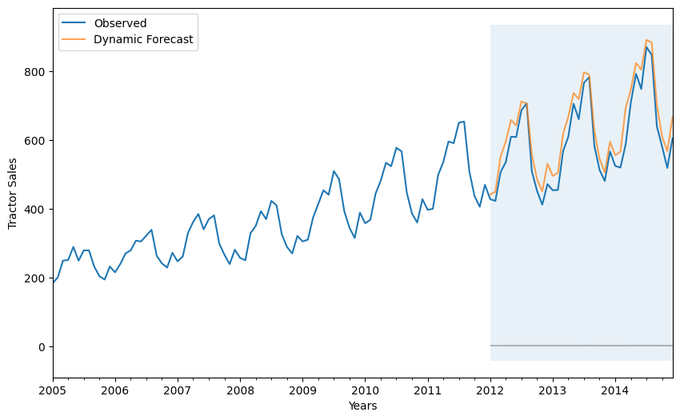
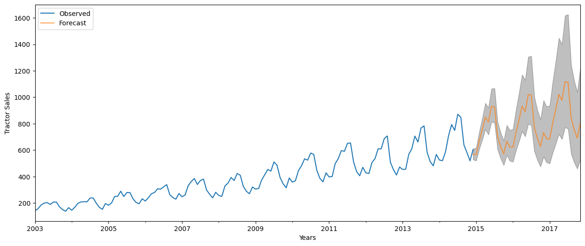
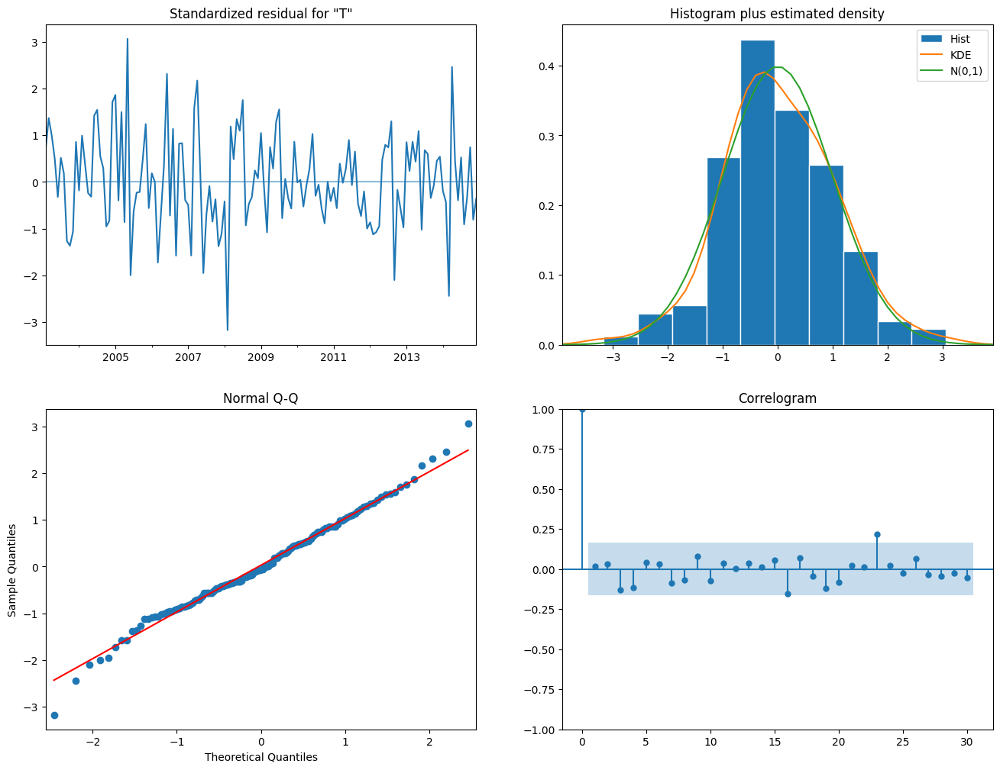

### Problem Overview

TractorPowerHorse, a tractor and farm equipment manufacturing company, was established a few years after World War II. The company has shown a consistent growth in its revenue from tractor sales since its inception. However over the years the company has struggled to keep it’s inventory and production cost down because of variability in sales and tractor demand. The management at PowerHorse is under enormous pressure from the shareholders and board to reduce the production cost. In the same they want to develop a time forecasting model to forecast sale / demand for next year. 

### Method Overview
ARIMA: ARIMA is a combination of 3 parts i.e. AR (AutoRegressive), I (Integrated), and MA (Moving Average). A convenient notation for ARIMA model is ARIMA(p,d,q). Here p,d, and q are the levels for each of the AR, I, and MA parts. Each of these three parts make the final residuals display which is a white noise pattern (or no pattern at all). In each step of ARIMA modeling, time series data is passed through these 3 parts.

### Result

1. Predict sales on in-sample data using the best fit ARIMA model

2. Forecast sales using the best fit ARIMA model for next three years

3. Plot ACF and PACF for residuals of ARIMA model to ensure no more information is left for extraction

